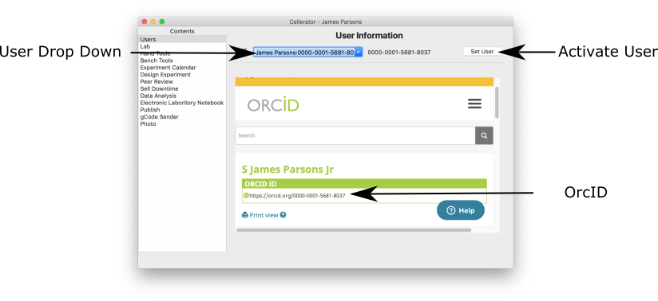
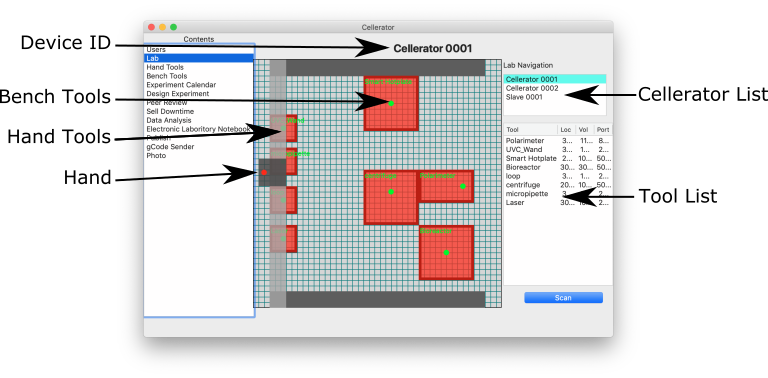
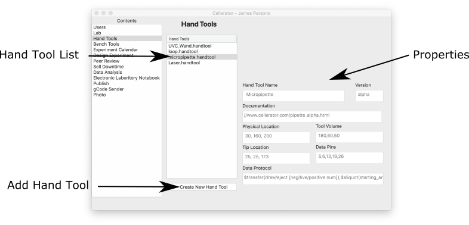
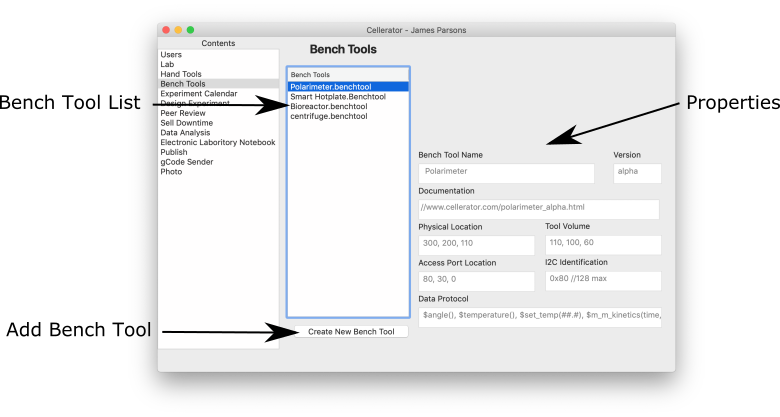
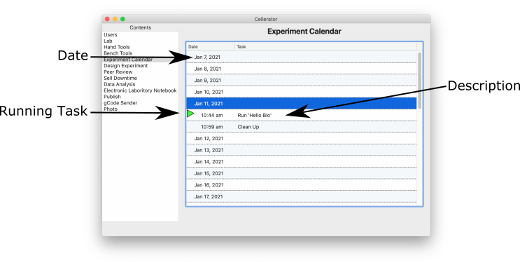
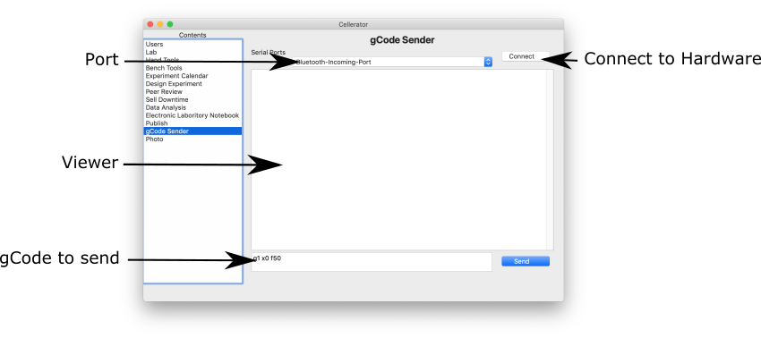

<p align="center">

</p>

# Ce11: Cellerator Code
*TL;DR* The code and documentation used to run Cellerator.

Cellerator hardware is controlled by the operating system.  This software is a combination of [python](https://www.python.org), [XOJO](https://www.xojo.com), and [gCode](https://en.wikipedia.org/wiki/G-code).  Python is used for its robustness, community support, open-source nature, and ease of use.  The programming language Xojo is used for its cross-platform GUI programming interface and ease of use, its ability to compiles ARM for the raspberry pi, and its ability to execute Python. The gCode programming language was because of its strong industry and maker support.

### Tabs
1. [User Login](#user-login)
2. [Lab](#lab)
3. [Hand Tools](#hand-tools)
4. [Bench Tools](#bench-tools)
5. [Experiment Calendar](#experiment-calendar)
6. [Design Experiment](#design-experiment)
7. [Peer Review](#peer-review)
8. [Sell Downtime](#sell-downtime)
9. [Data Analysis](#data-analysis)
10. [Electronic Laboratory Notebook](#electronic-laboratory-notebook)
11. [Publish](#publish)
12. [gCode Sender](#gcode-sender)
13. [Photo](#photo)


## User Login
<p align="center">

</p>
*TL;DR* Logging into Cellerator adds the user signature to each process.

>`" Anonymity is the death of responsibility, accountability, and credibility"` ~ S James Parsons Jr

**About:**
 When you first log into Cellerator application the first page loaded is the **Login** page.  This page loads oricid.org and the user is prompted to log in.  Once logged in Cellerator acquires the users sixteen-digit ^0000-0000-0000-0000^ [ORCID](http://orcid.org) to sign each step of your experiment.

**From the site**
>ORCID provides a persistent digital identifier (an ORCID iD) that you own and control, and that distinguishes you from every other researcher. You can connect your iD with your professional information — affiliations, grants, publications, peer review, and more. You can use your iD to share your information with other systems, ensuring you get recognition for all your contributions, saving you time and hassle, and reducing the risk of errors.


|Code|Version  |Date |
|--|--|--|
| [XOJO Orcid ID Code](./code/OrcidID/OrcidID.md)| *α*lpha |2020/12/22|


## Lab

<p align="center">

</p>

*TL;DR* The Lab page is a snapshot of all Cellerators under your control, with quick feature access.

>`"There are two spiritual dangers in not owning a farm. One is the danger of supposing that breakfast comes from the grocery and the other that heat comes from the furnace."` ~Aldo Leopold

**About:** The **Lab** page is a snapshot of your Cellerator Setup.  This snapshot is a bird's eye view of your local and recruited Cellerators. Whether you have a single Cellerator, Cellerator extender, Dual Cellerators, recruited Cellerators, or a Cellerator farm.  The Lab page also manages the calibration and tool scan.

The snapshot shows a quick overview of each cellerator, with quick links to other features.

The scan tool uses QR Codes located on hand tools and bench tools to aid in the construction of a virtual lab keeping track of hardware locations.

|Code|Version  |Date |
|--|--|--|
| [MD file](LINK)| *α*lpha *β*eta *γ*amma 1.0 |YYYY/MM/DD|

## Hand Tools

<p align="center">

</p>

*TL;DR* View, edit, add, and delete hand tools.

>`“I suppose it is tempting, if the only tool you have is a hammer, to treat everything as if it were a nail.”` ~ Abraham Maslow

**About:**  The **Hand Tool** page allows the user to modify the features of hand tools. On the Hand tool page, you start by selecting the Cellerator, once selected a list of active hand tools is displayed. From here you can view, add, delete, or update drivers for hand tools.

When viewing the properties of a hand tool, first you click on the hand tool of interest. This loads and displays data about this tool; Name, Firmware Version, Documentation Link, Physical Location, Tool Volume, Tip Location, Data Pins, and Data Protocol. Each field can be updated from this page.  
1. *Name*: can be changed if multiple of the same tools are present.
2. *Firmware Version*: is displayed as a number, if a new version is available a download arrow is present.
3. *Documentation*: Contains a URL to the online documentation on the selected hand tool.
4. *Physical Location*: This is a global variable for Cellerator knows where to acquire the tool.
5. *Tool Volume*: This helps Cellerator move the Hand Tool in 3D space and avoid obstacles.
6. *Tip Location*: This tells Cellerator where the tip is located in 3D space in relation to an experiment and bench tool access ports location.
7. *Data Pins*: this explains which pins are utilized and the mode of the pin.
8. *Data Protocol*: This contains the language reference of the hand tool.
</br></br>**NOTE:** These properties are attached to the experiment.


Some experiments may call for additions or custom hand tools, the **add** functions, allows the user to add a hand tool.  The process includes filling out the associated property fields.

Obsolete or unused hand tools can be deleted and removed from the tool library.  The hand tool profile is saved in an inactive state, which can be easily reactivated.


|Code|Version  |Date |
|--|--|--|
| [MD file](LINK)| *α*lpha *β*eta *γ*amma 1.0 |YYYY/MM/DD|

## Bench Tools

<p align="center">

</p>

*TL;DR* View, edit, add, and delete Bench Tools.

>`“The Law of Probabilities: the more things you try, the more likely one of them will work.”` ~ Jack Canfield

**About:**  The **Bench Tool** page allows the user to modify the features of bench tools. On the bench tool page, you start by selecting the Cellerator, once selected a list of active bench tools is displayed. From here you can view, add, delete, or update drivers for bench tools.

When viewing the properties of a bench tool, first you click on the bench tool of interest. This loads and displays data about this tool; Name, Firmware Version, Documentation Link, Physical Location, Tool Volume, Access Port Location, I2C Identification, and Data Protocol. Each field can be updated from this page.  
1. *Name*: can be changed if multiple of the same tools are present.
2. *Firmware Version*: is displayed as a number, if a new version is available a download arrow is present.
3. *Documentation*: Contains a URL to the online documentation on the selected hand tool.
4. *Physical Location*: This is a global variable for Cellerator knows where to find the bench Tools.
5. *Tool Volume*: This helps Cellerator move the Hand Tool in 3D space and avoid obstacles.
6. *Access Port Location*: This tells Cellerator the location where hand tools can deposit from the tooltip.
7. *I2C Identification*: this identifies the bench tools I2C address.
8. *Data Protocol*: This contains the language reference of the hand tool.
</br></br>**NOTE:** These properties are attached to the experiment.


Some experiments may call for additions or custom bench tools, the **add** functions, allows the user to add a bench tool.  The process includes filling out the associated property fields.

Obsolete or unused bench tools can be deleted and removed from the tool library.  The bench tool profile is saved in an inactive state, which can be easily reactivated.


|Code|Version  |Date |
|--|--|--|
| [MD file](LINK)| *α*lpha *β*eta *γ*amma 1.0 |YYYY/MM/DD|

## Experiment Calendar

<p align="center">

</p>

*TL;DR* Visual of Cellerator schedule.

>`“The secret of getting ahead is getting started. The secret of getting started is breaking your complex overwhelming tasks into small manageable tasks, and starting on the first one."` ~ Mark Twain

**About:** The **Experiment Calendar** page helps visualize Cellerator experiments over time. The list is broken down into days.  Days with Cellerator tasks are followed with rows with the time Cellerator will execute a scheduled task. This calendar is also a place to visualize downtime for selling.

|Code|Version  |Date |
|--|--|--|
| [MD file](LINK)| *α*lpha *β*eta *γ*amma 1.0 |YYYY/MM/DD|

## Design Experiment

*TL;DR* An environment for coding cellerator, either guided or low level.

>`"Have no fear of perfection -- you’ll never reach it."` -- Salvador Dali, artist

**About:** The *Design Experiment* page is the programming interface for Cellerator. The user can program Cellerator using the guided interface or the advanced coding view.

The guided interface is based on the scientific method.  Guiding the user through a hypothesis generator, research, and experiment designer.

The hypothesis generator asks a simple question to get to the root idea.  The data is used in the acquisition of research material, and the importation of similar experiments and protocols.

The research stage of the design experiment queries scientific and non-scientific databases to fine overlapping research material.  The sources of each paper, article, URL, and protocol are stitched into a node network.  This node network is interactive, where the user clicks on a node to see the article, closely repeated articles are pooled together.  
- [ ] A future versions will utilize AI to help the researcher find valuable information.  This source data, notes, and comments are synced with Zotero for cross-collaboration and able to work on research away from Cellerator.

The experiment designer uses a combination of the research notes and thesis to guide the researcher in making an experiment with proper controls using dependent and independent variables.  The experiment designer can use pre-defined or user-generated protocols. These protocols start with a human-readable section followed by Cellerator Code, DAVR. The protocol is broken down into tasks, and tasks are broken down into steps. Protocols are collections of tasks, and tasks are a collection of steps. Each step is coded using DAVR. **DAVR** consists of four calls standing for **D**evice, **A**ction, **V**erification, and **R**ecord.

1. **Device** Call: Indicates what device is being used whether it's the hand, hand tool, bench tool, or environmental controls.
2. **Action** Call: specifies what the specified devices are to do.    
• The hand can be sent move command based on gCode or global variables, like hand_tool(location). <br>• Hand tools are sent GPIO pin mode data with data protocol specified by the hand tool feature. <br>• Bench tools are sent I2C identifier and data protocol specified by the bench tool feature. <br>• Environmental controls can be set, like temperature = 25°C.
3. **Verification** Call: Uses sensors, IO tool data, and the camera to check that the hand/bench tool functioned correctly with the active call.
4. **Record** Call: Collects all data from the step and appends the data to the ELN (electronic laboratory notebook) and updates the live HTML page.

**EXAMPLE Syntax**
```
%Device(Action)[Verification][Record]
Light(ON)[camera(take_picture)][<p>Picture with Light on</p>]
```

|Code|Version  |Date |
|--|--|--|
| [MD file](LINK)| *α*lpha *β*eta *γ*amma 1.0 |YYYY/MM/DD|


## Peer Review

*TL;DR* A place to collaborate with colleagues and experts.  

>`“The modern research laboratory can be a large and complicated social organism.”` ~ J. Michael Bishop, How to Win the Nobel Prize: An Unexpected Life in Science

**About:** The **Peer Review** page is a community forum for collaboration, constructive criticism, and peer review.  The form is broken down into your current research, past publications, colleague research, and community forum. This leverages your educational and professional background to collaborate on your research and others.  

Users current project is tagged with specific keywords that align with research profiles to better match experiments to contributors.

The past publication section is a forum for your past works.  The users of a past publication are considered a specialist. If a peer reruns your experiment their datasets is appended to the original data, if the data is outside a standard deviation, then the data is flagged.  The more reruns the bigger the effect size led to the true outcome regardless of origination, this creates dynamic error correction.  - [ ] conflicts will be reviewed by CE11.

Use the favorite feature to add users to hour personal network, these favorite members will allow for Colleague research forum.  This allows for direct communication without the approval process.

Community forum


|Code|Version  |Date |
|--|--|--|
| [MD file](LINK)| *α*lpha *β*eta *γ*amma 1.0 |YYYY/MM/DD|


## Sell Downtime

*TL;DR* Lease or buy cellerator downtime.

>`“Money can be exchanged for goods and services!"`
~ Homer Simpson

**About:** The **Sell Downtime** page is a tool that enables Cellerator owners to spread the load or outsource experiments on other Cellerator who have ample downtime. First, the Cellerator owner needs to turn on the Opt-in switch that enables the feature.  Once apt-in the owner will verify its public geographic approximation and specific shipping address.  Once complete, the sellers and buyers will be ordered in order of distance closest to furthest and by capabilities.  There are two sections; one for users who are selling downtime and if an experiment is ready to run an option to spread load task is also available.  The monetary compensation will include supplies, shipping costs, and a pro-rated time.

**NOTE**
- [ ] Add marketplace for hand tools and bench tools.

|Code|Version  |Date |
|--|--|--|
| [MD file](LINK)| *α*lpha *β*eta *γ*amma 1.0 |YYYY/MM/DD|


## Data Analysis

*TL;DR* Suite of tools for visualizing collected data.

>`“Imagination is the research laboratory of discovery."`~ Steven Magee" ~

**About:**  The **Data analysis** page is a tool that helps data modeling in real-time.

First, in the experiment designer, the researcher will specify which of the collected data will be used to validate the hypothesis, then the researcher will make an educated prediction on the processes based on research.  This prediction will be modeled alongside the collected data in real-time.  If the real-time collected data is different from the predicted graph Cellerator will notify the user via digital messaging to course correct the experiment.  

- [ ] This page will also have a suite of statistical and image processing tools that can be applied to the collected data to create beautiful graphics.


|Code|Version  |Date |
|--|--|--|
| [MD file](LINK)| *α*lpha *β*eta *γ*amma 1.0 |YYYY/MM/DD|


## Electronic Laboratory Notebook
*TL;DR* ELN keeps a running notebook of everything that is done.

>`“Remember, kids, the only difference between screwing around and science is writing it down."` ~ Adam Savage, Mythbusters

The **Electronic Laboratory Notebook** page is the accumulated data generated from the entire experiment formatted in HTML.  The ELN document contains a title, author information, start date, protocol with DAVR code, data analysis, summary/conclusion, and tool outline.

1. *Title*: is acquainted with the experiment designer using the h1 HTML tag
2. *Subtitle*: is acquired form the experiment designer using then h2 HTML tag
3. Author(s) information* contains the primary machine owner (PI), the login in users, collaborators, and outsourcers.  All names contain a link to their Orcid ID profile.
4. *date* contains the start date, end date, and runtime Cellerator worked on the experiment.
5. *Hypothesis* speculation or proposed explanation made based on limited evidence as a starting point for further investigation.
6. Research outline
7. *protocol with DAVR code* this is a chronological div list of the experiment protocol, followed by the DAVR code, and ending with the results and collected data.  The div is labeled with start time at the top and finished time at the end.  Currently, active steps are marketed with a tuning icon, finished steps are marked with a checkmark, error codes are marked with an exclamation hazard icon, pending steps and marked with a blank check box.
8. *data analysis* takes the collected results and processes them in real-time with specified statistical tools, image processing.
9. * summary* a brief statement or account of the main points of the experiment.
10. *conclusion* judgment or decision reached by reasoning
11. *tool outline* this section contains the make, model, firmware version, and calibration data for used tools.

|Code|Version  |Date |
|--|--|--|
| [MD file](LINK)| *α*lpha *β*eta *γ*amma 1.0 |YYYY/MM/DD|


## Publish
*TL;DR* Sharing data created with Cellerator.

>`“In vain have you acquired knowledge if you have not imparted it to others.” Deuteronomy Rabbah.”` ~ Deuteronomy Rabbah

**About:**  The **Publications** page is designed to handle the output of generated data.  The data is broken down into pre-experiment, during-experiment, and post-experiment. The pre-experiment data is composed of research, notes, protocol, DAVR code, and thesis.  The during-experiment data is composed of raw collected data; CSV (comma separated values), images, videos.  And the post-experiment data is composed of the processed data (graphs, processed images, and statistical analysis), summary, and conclusion.

By default, a secondary backup is stored on the Ce11 servers.  This backup is only accessible by the creator and the owner.  

1. Pre-experiment data is made public for Peer Review.  This can also be published to third-party sites; google drive, OSF (Open Science Foundation), Benchling, StackExchange, GitHub, and others.

2. Durning-experiment data is owned by the creator.  The creator can specify if the data is freely accessible or has a paywall.

3. Post-experiment data is made public for Peer Review.  This can also be published to third parties sites; online publications, journals, NIH.

- [ ] Future feature is social media integration to publish results in realtime to get community feedback outside of the peer review environment; Twitter, Facebook, Reddit, Instagram.

- [ ] Some other add-on features include BioTorrent.de data sharing.


|Code|Version  |Date |
|--|--|--|
| [MD file](LINK)| *α*lpha *β*eta *γ*amma 1.0 |YYYY/MM/DD|


## gCode Sender

<p align="center">

</p>

*TL;DR* The console for direct gCode sending.

>`“Quality means doing it right when no one is looking.”` ~ Henry Ford

**About:** Cellerator is a Cartesian robot that moves in 3D space.  CNC machines, routers, pick and place robots, and 3D printers use gCode to move around in 3D space.  Cellerator also uses gCode.  This console is an advanced feature to troubleshoot and manipulates Cellerators movement using gCode.  

|Code|Version  |Date |
|--|--|--|
| [MD file](LINK)| *α*lpha *β*eta *γ*amma 1.0 |YYYY/MM/DD|


## Photo
*TL;DR* A test area for experimenting with images and image manipulation.  

>`“A picture is worth a thousand words"` ~ Everyone

**About:** The **Photo** page is a testing environment for images taken by Cellerator, and python image manipulation functions.  

|Code|Version  |Date |
|--|--|--|
| [MD file](LINK)| *α*lpha *β*eta *γ*amma 1.0 |YYYY/MM/DD|

## Authors

* **[S James Parsons Jr](https://www.linkedin.com/in/sjamesparsonsjr/)**

## License

This project is licensed under the MIT License - see the [LICENSE.md](LICENSE.md) file for details
