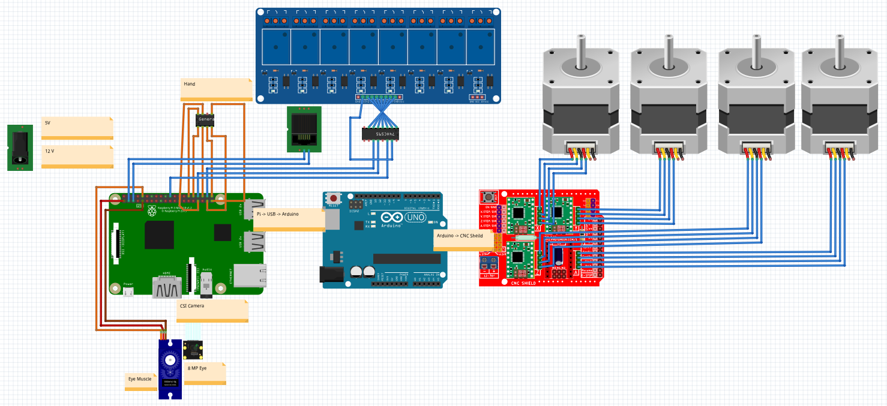
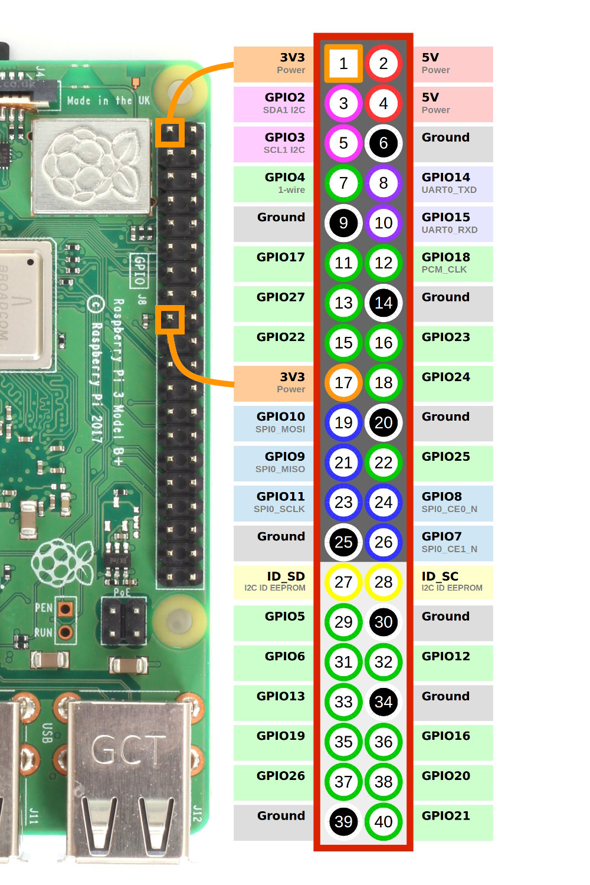

# Ce11: Cellerator Electrical
*TL;DR* An overview on the foundational electronics in Cellerator.

Cellerator electronics uses an anatomical naming convention, see the Anatomy reference below for more infomration.  The basic images are generated using [Fritzing](https://fritzing.org/download/).

## Parts list
|Qty | Name | Cost | URL | Notes |
|---|---|---|---|---|
| 1 | Raspberry Pi 4 Modl B - 8 gb | $70.00 |[Microcenter](https://bit.ly/3oJ8yun) | |
|1| 8MP Camera|$25.40|[Amazon](https://amzn.to/3jePDqk)||
|1|Arducam CSI to HDMI Cable|$13.99|[Amazon](https://amzn.to/2ClItzi)||
|1|SG90 9G Servo|$1.87|[Amazon](https://amzn.to/3jcReNv) | |
|1|8-Channel Relay|$7.25|[Amazon](https://amzn.to/3cFktay)||
|9|RJ11 Sockets|$4.15|[Amazon](https://amzn.to/3trijRN)||
|1|Shift-Out Register 74hc595 |$0.74|[Amazon](https://amzn.to/2MWoj4g)||
|1|RJ45 Breakout Board|$4.50|[Amazon](https://amzn.to/3avwrke)|
|8|Pogo Pin|$0.92|[Amazon](https://amzn.to/3pKxsLy)|**Under development**|
|1|Arduino Uno R3|$6.99|[Amazon](https://amzn.to/2YDZIUe)||
|1|CNC Shield|$5.99|[Amazon](https://amzn.to/3oK4MRB)|||
|4|Stepper Driver 14988|$9.99|[Amazon](https://amzn.to/2YFCkFM)||
|4| Nema 7 Stepper Motors|$36.79|[Amazon](https://amzn.to/36CApqc)||
|1|ATX Power Supply|$27.99|[Amazon](https://amzn.to/2NZRCmN)||
||||||
||||||
|1| 12 Water Pump|$8.99|[Amazon](https://amzn.to/3rkTDZ4)|**Under development**|
|1| 12V Vacuum pump|$21.95|[Amazon](https://amzn.to/3rnAGoy)|**Under development**|
|1|Addressable RGB LEDs|$10.88|[Amazon](https://amzn.to/3pN2WRo)|**Under development**|
|1|Motor Drive Controller Board|$6.50|[Amazon](https://amzn.to/2MNmKp4)|**Under development**|
|||||
|1|7 inch LCD Display|$61.99|[Amazon](https://amzn.to/3pQFVwQ)||

### Anatomy
1. [Brain: Raspberry Pi](#brain)
2. [Eye and Eye Muscle: 8 MP Camera and SG90 Servo](#lab)
3. [Spinal Cord: 8 Channel relay and IC2 line on an RJ11](#spinal_cord)
4. [Hand: 6 GPIO (General Purpose Input output pin)](#hand)
5. [Heart: Power Supply (12v, 5v)](#heart)
6. [Muscles: ](#muscles)
7. [Lungs](#lungs)

## Brain

*TL;DR*  The Raspberry Pi is the brain of Cellerator that controls moments, image capture and processing, and external and internal device communication.

>`""

**About:**
The Raspberry Pi is a single board computer (SBC).

|Code|Version  |Date |
|--|--|--|
| | *α*lpha |20XX|

## Eye

*TL;DR*  

>`""

**About:**

|Code|Version  |Date |
|--|--|--|
| | *α*lpha |20XX|

## Spinal Cord

*TL;DR*  

>`""

**About:**

|Code|Version  |Date |
|--|--|--|
| | *α*lpha |20XX|

## Eye

*TL;DR*  

>`""

**About:**

|Code|Version  |Date |
|--|--|--|
| | *α*lpha |20XX|

## Hand

*TL;DR*  

>`""

**About:**

|Code|Version  |Date |
|--|--|--|
| | *α*lpha |20XX|
## Heart

*TL;DR*  

>`""

**About:**

|Code|Version  |Date |
|--|--|--|
| | *α*lpha |20XX|

## Muscle

*TL;DR*  

>`""

**About:**

|Code|Version  |Date |
|--|--|--|
| | *α*lpha |20XX|

## Lungs

*TL;DR*  

>`""

**About:**

|Code|Version  |Date |
|--|--|--|
| | *α*lpha |20XX|

## Authors

* **[S James Parsons Jr](https://www.linkedin.com/in/sjamesparsonsjr/)**

## License

This project is licensed under the MIT License - see the [LICENSE.md](LICENSE.md) file for details

# Ce11: Cellerator Electronics Outline
OpenSource Laboratory Robot

### Tabs
1. [Circuit Anatomy](#Circuit Anatomy)
2. [Brain](#brain)
2. [Power](#lab)
3. [Eye](#hand-tools)
4. [Hand](#bench-tools)

# Circuit Anatomy

[More Information on Shif Register](https://lastminuteengineers.com/74hc595-shift-register-arduino-tutorial/)

Cellerator I2C communciation

This document is for handeling I2C communication from Cellerator to peripheral devices.

Currently Arduino's in devices are using A4 (SDA) and A5 pins (SCL) with 12v and GND

RJ11 Plug

+------------+
|            |
|  | | | |   |
|  | | | |   |
+-|1|2|3|4|-+

Pin 1 - BLUE Wire = SCL (A5)
Pin 2 - Green Wire = SDA (A4)
Pin 3 - Black Wire = Ground
PIn 4 - Red Wire = 12V

This is the online repository for the OpenSource hardware project Cellerator.

[CellEleven website](http://www.celleleven.com/cellerator)|[Cellerator 3D files](https://cad.onshape.com/documents/5c8c29e275c3d6ad24e851a0/w/f1721dd44bb4fc0688265a60/e/036a6ba0b35b22a34429db9e)|[Cellerator Code Outline](/code_outline.md)

- [ ] **NOTE*** PUT IMAGE OF CELLERATOR NEXT TO LABASSISTANT

## Introduction

**Cellerator** _a ce11 product_ is a computer controlled laboratory technician that allows precision handling of biological supplies, with the aid of hand tools, and bench tools.  The protocol is validated via images processed by the computer, and data collected from environmental sensors.   All data saved and graphs are published to the community.

## Parts of Cellerator
_To help users identify parts, and to teach anatomy, the parts of Cellerator are named after parts of the body with similar functions._

#### Central Nervous System (CNS)
* Brain ----> Raspberry Pi 5V
* Spinal Cord ----> RJ11 Hub and RJ11 Wire, GPIO Pins

#### Peripheral Nervous System (PNS)
* Cranial Nerves ----> RPi: HDMI out, WiFi, Audio Jack, CSi interface [Camera], DSI Port [Touch Screen],
  * *Eye* 8 megapixel Camera is attached to the CSi Port
  * *Eye Muscle* The Pan and Tilt will be connected to GPIO Pin (GND, 3V3, GPIO15, GPIO16)
* Spinal Nerves ----> IC2 Communication Protocol to Arduino Micro Controller
* Sensory ---->  [UART, or SPI (I2C is for PNS)] Arduino can talk to sensors

#### Muscular system
* Muscle ----> [UART, or SPI (I2C is for PNS)] Arduino can talk to steppers, motors, actuators, and power supply
  * gCODE controlled via USB on an Arduino
* Bone ----> Currently extruded aluminum, working on sheet metal.
* Hand ----> 8 GPIO pogo pin (5v, GROUND, GPIO13, GPIO25, GPIO16, GPIO26, GPIO20, GPIO21)
* Finger ----> Grabber for manipulation of items (5v, GROUND, GPIO32)

#### Vital Organs
* Heart ----> 12V 10A Power Supply
  * Cardio Vascular System ----> Wires, RJ11
  * Precapillary sphincters ----> RJ11 Power Relay (12V, GND, DS, SHCP, STCP) GPIO22-25 Shift Register
* Lungs ----> _Gas Tank, CO2 Tank (what about Bioreactor that produces CO2 [yeast] O2 [Algae])_
  * _pending_ Cilia ----> HEPA negative Air-filter
  * _pending_ Diaphragm ----> Air Pump Relay, Air Vacuum Relay (5V, GRD, GPIO22-25 Shift Register)
* _pending_ Skin ----> designed to keep the workspace sterile
* _pending_ Stomach ----> Hot plate, mixing plate, illumination (RGBw), chemical reagent factory.
* _pending_
wait -- {Kidney} Centrifuge (I2C)
wait -- {Loop of Henle} Electrophoresis
wait -- {Bladder} Waste fluid tank
wait -- {Reproductive} Bioreactor, Electro Proration

#### Mouth / Face
* Mouth ----> Load Cartridge, Arduino CNC switch?
* Vocal Cords ----> Output Speaker, Wifi
* Salivary gland ----> Water Pump Relay (5V, GND, GPIO22-25 Shift Register)
* Face ----> Output Display
* _Pending Ear_ ----> Sound Sensor (USB Microphone)
* _Pending Nose_ ----> Air Sensor: MQ-135 MQ135 Air Quality Sensor (5V, GND, TTL switch signal output, AO: analog Signal Output)

## Tools

### Hand Tools
_All hand tools contain a QR Code to validate the correct tool is selected regardless of the location_
* Laser
* Pipette
* Loop
* homogenizer
*

### Bench Tools
*
