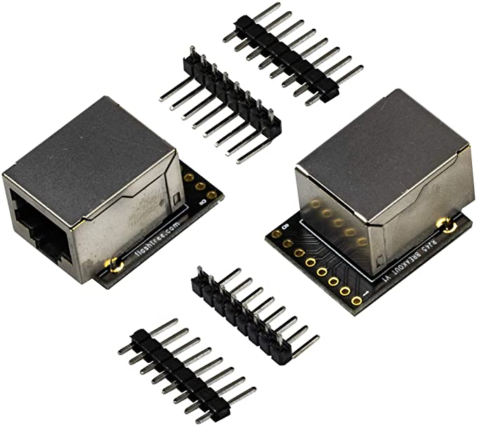

<p align="center">

</p>

# Ce11: Cellerator Electrical

*TL;DR* An overview on the foundational electronics in Cellerator.

Cellerator electronics uses an anatomical naming convention, see the Anatomy reference below for more infomration.  The basic images are generated using [Fritzing](https://fritzing.org/download/).

<p align="center">

</p>

## Parts list
|Qty | Name | Cost | URL | Notes |
|---|---|---|---|---|
| 1 | Raspberry Pi 4 Modl B - 8 gb | $70.00 |[Microcenter](https://bit.ly/3oJ8yun) | |
|1| 8MP Camera|$25.40|[Amazon](https://amzn.to/3jePDqk)||
|1|Arducam CSI to HDMI Cable|$13.99|[Amazon](https://amzn.to/2ClItzi)||
|1|SG90 9G Servo|$1.87|[Amazon](https://amzn.to/3jcReNv) | |
|1|8-Channel Relay|$7.25|[Amazon](https://amzn.to/3cFktay)||
|9|RJ11 Sockets|$4.15|[Amazon](https://amzn.to/3trijRN)||
|1|Shift-Out Register 74hc595 |$0.74|[Amazon](https://amzn.to/2MWoj4g)||
|1|RJ45 Breakout Board|$4.50|[Amazon](https://amzn.to/3avwrke)|
|8|Pogo Pin|$0.92|[Amazon](https://amzn.to/3pKxsLy)|**Under development**|
|1|Arduino Uno R3|$6.99|[Amazon](https://amzn.to/2YDZIUe)||
|1|CNC Shield|$5.99|[Amazon](https://amzn.to/3oK4MRB)|||
|4|Stepper Driver 14988|$9.99|[Amazon](https://amzn.to/2YFCkFM)||
|4| Nema 7 Stepper Motors|$36.79|[Amazon](https://amzn.to/36CApqc)||
|1|ATX Power Supply|$27.99|[Amazon](https://amzn.to/2NZRCmN)||
||||||
||||||
|1| 12 Water Pump|$8.99|[Amazon](https://amzn.to/3rkTDZ4)|**Under development**|
|1| 12V Vacuum pump|$21.95|[Amazon](https://amzn.to/3rnAGoy)|**Under development**|
|1|Addressable RGB LEDs|$10.88|[Amazon](https://amzn.to/3pN2WRo)|**Under development**|
|1|Motor Drive Controller Board|$6.50|[Amazon](https://amzn.to/2MNmKp4)|**Under development**|
|||||
|1|7 inch LCD Display|$61.99|[Amazon](https://amzn.to/3pQFVwQ)||
||Total|**$326.88**||


### Anatomy
1. [Brain: Raspberry Pi](#brain)
2. [Eye and Eye Muscle: 8 MP Camera and SG90 Servo](#eye)
3. [Spinal Cord: 8 Channel relay and IC2 line on an RJ11](#spinal-cord)
4. [Hand: 6 GPIO (General Purpose Input output pin)](#hand)
5. [Heart: Power Supply (12v, 5v)](#heart)
6. [Muscles: ](#muscle)
7. [Lungs](#lungs)


## Brain
<p align="center">

</p>

*TL;DR*  The Raspberry Pi is the brain of Cellerator that controls moments, image capture and processing, and external and internal device communication.

>**Dr. Frederick Frankenstein**: Whose brain did you put in him?<br>
**Igor**: Err... Abby something...<br>
**Dr. Frederick Frankenstein**: Abby who?<br>
**Igor**: Abby... Normal. Yes that's it, Abby Normal!<br>
**Dr. Frederick Frankenstein**: Are you saying that you put an abnormal brain in a 7 foot tall, 54 inch wide GORILLA!!!??? <br><br>*Young Frankenstein*

**About:**
Raspberry Pi is a small single-board computer (SBC) developed in the United Kingdom by the [Raspberry Pi Foundation](https://www.raspberrypi.org/about/) in association with Broadcom. The Raspberry Pi board used in Cellerator utilizes the ARM processor, CSI camera input, GPIO pins, and USB ports. The ARM processor runs the operating system, executes Cellerator software, and manages IO communication protocols.  The CSI camera-input collects images and videos from the 8 MP camera. The GPIO pins can send and receive digital signals. Lastly, two of the four USB ports implement data storage and linear movement. One USB port is for saving data to an external hard-drive. The other USB port sends and receives data from the Arduino drivetrain via the serial protocol.

**Wire Diagram**
```
5VDC -> [Raspberry Pi] <-> GPIO pins
                      |<- CSI Camera Port
                      |<-> Ethernet
                      |-> HDMI
                      |-> Audio Jack
                      \<-> USB
```

|Code|Version  |Date |
|--|--|--|
| | *α*lpha |20XX|


## Eye
<p align="center">

</p>

<p align="center">

</p>


*TL;DR*  The 8 MP camera is the eye of Cellerator and the foundation of all Cellerator preformed actions.

>`"Seeing is believing and believing is knowing and knowing beats unknowing and the unknown."` <br> ~ Philip Roth

**About:**

The 8 MP camera (eye) is attached to the Z-axis arm connected to a servo motor (eye muscle) capable of moving the camera 180°.  The 8 MP camera and the SG90 servo connect to the raspberry pi via the Arducam HDMI extender (Optic canal).  The Arducam extender is a PCB breakout board containing an HDMI port (19 pins) to CSI port (15 pins) and auxiliary (3 pins).  The CSI port connects the 8 MP camera, and the auxiliary connects the servo.


**Wire Diagram**
```
                                +---------+            +---------+
[ Raspberry Pi ] -> CSI <------ |Arducam  | <--HDMI--> |Arducam  | <---- 8 MP Camera
               | -> GPIO 15 <-> | extender|            | extender| -----> SG90 Servo
               | -> GROUND ---> |         |            |         | --|
               \ -> 5VDC -----> |         |            |         | --/
                                +---------+            +---------+


```

|Code|Version  |Date |
|--|--|--|
| | *α*lpha |20XX|


## Spinal Cord
<p align="center">

</p>

<p align="center">

</p>

*TL;DR* The Spinal cord is a combination of an 8-channel high voltage power relay and a RJ11 jack running a I2C Bus.  

>`"It doesn't make sense to hire smart people and then tell them what to do. We hire smart people and they tell us what to do."` ~ Steve Jobs


**About:**
Cellerator's spinal cord is made up of an 8-channel relay and an I2C data bus.  The 8-Channel relay is connected to the Raspberry Pi via a 74HC595 Shift out register.  The 74HC595 Shift out resister takes 3 data pins from the Raspberry Pi (18, 20, and 25) and outputs data to the 8 input pins of the 8-channel relay.  This 8-channel relay module is scalable for a multiple of 8 daisy chains, or 64 individual relays.  The I2C takes four lines; 12VDC, GRD, SDA, and SCL. The RJ11 data bus module is scalable to 128 individual unique identified devices.  

- [ ] Verify Pins

**Shift out wire diagram**
```
                            +--------+
[Relay In 2] ------ QB 1 --O|         |0-- 16 VCC -------[ Power 5V] XXX CHECK XXX
[Relay In 3] ------ QC 2 --O|    7    |0-- 15 QA --------[Relay In 1]
[Relay In 4] ------ QD 3 --O|    4    |0-- 14 SER -------[Raspberry Pi GPIO 25] XXX CHECK XXX
[Relay In 5] ------ QE 4 --O|    H    |0-- 13 OE
[Relay In 6] ------ QF 5 --O|    C    |0-- 12 RCLK ------[Raspberry Pi GPIO 19] XXX CHECK XXX
[Relay In 7] ------ QG 6 --O|    5    |0-- 11 SRCLK -----[Raspberry Pi GPIO 20] XXX CHECK XXX
[Relay In 8] ------ QH 7 --O|    9    |0-- 10 SRCLR
[ Ground   ] ----- GND 8 --O|    5    |0-- QH
                             +--------+
```


<p align="center">

</p>

**RJ11 jack with I2C wire diagram**
```
                         +----------+
[GPIO 1] --Blue-Wire----[1]===      |
[GPIO 2] --Green-Wire---[2]===   / --+  <- RJ11
[Ground] --Black-Wire---[3]===   \ --+
[12VDC ] --Red-Wire-----[4]===      |
                         +----------+


Pin [1] = SCL (Arduino Uno A5)
Pin [2] = SDA (Arduino Uno A4)
Pin [3] = Ground
PIn [4] = 12V

```

|Code|Version  |Date |
|--|--|--|
| | *α*lpha |20XX|


## Hand
<p align="center">

</p>

*TL;DR* The hand is attached to the z-axis arm and can interface with Hand Tools using 6 GPIO pins.

>`"He pushed away from her and raised his arm, forcing his stump into her face. "A Hand without a hand? A bad jape, sister. Don't ask me to rule."` ~ George R.R. Martin, A Feast for Crows

**About:**
The hand is made of of pogo-pins, water-line and air-line.  There are eight pogo-pins, two pins are used for power and six pins used for data.  The pogo-pins are connected the the Raspberry Pi GPIO pins via a two RJ45 breakout board allowing for the use of an Ethernet cable connection.  The pogo-pins are connected to GPIO pins (01, 02, ... 08).  The water line is controlled by a 12VDV water pump.  The water pump is connected replay controlled by (GPIO xxx). The air line is controlled by a 12VDV air pump.  The air pump is connected replay controlled by (GPIO xxx)


**Wire Diagram**
```
[Raspberry Pi] -> GPIO 00
             | -> GPIO 00
             | -> GPIO 00
             | -> GPIO 00
             | -> GPIO 00
             | -> GPIO 00
             | -> GND
             \ -> 12VDC

```

|Code|Version  |Date |
|--|--|--|
| | *α*lpha |20XX|


## Heart
<p align="center">

</p>

*TL;DR*  

>`"Quote"` ~ Author

**About:**

**Wire Diagram**
```
5VDC -> [Raspberry Pi] <-> GPIO pins
                      |<- CSI Camera Port
                      |<-> Ethernet
                      |-> HDMI
                      |-> Audio Jack
                      \<-> USB
```

|Code|Version  |Date |
|--|--|--|
| | *α*lpha |20XX|


## Muscle
<p align="center">

</p>

*TL;DR*  

>`"Quote"` ~ Author

**About:**

**Wire Diagram**
```
5VDC -> [Raspberry Pi] <-> GPIO pins
                      |<- CSI Camera Port
                      |<-> Ethernet
                      |-> HDMI
                      |-> Audio Jack
                      \<-> USB
```

|Code|Version  |Date |
|--|--|--|
| | *α*lpha |20XX|

## Lungs
<p align="center">

</p>

*TL;DR*  

>`"Quote"` ~ Author

**About:**

**Wire Diagram**
```
5VDC -> [Raspberry Pi] <-> GPIO pins
                      |<- CSI Camera Port
                      |<-> Ethernet
                      |-> HDMI
                      |-> Audio Jack
                      \<-> USB
```


|Code|Version  |Date |
|--|--|--|
| | *α*lpha |20XX|


## Authors

* **[S James Parsons Jr](https://www.linkedin.com/in/sjamesparsonsjr/)**

## License

This project is licensed under the MIT License - see the [LICENSE.md](LICENSE.md) file for details


# Ce11: Cellerator Electronics Outline
OpenSource Laboratory Robot
<p align="center">

</p>

### Tabs
1. [Circuit Anatomy](#Circuit Anatomy)
2. [Brain](#brain)
2. [Power](#lab)
3. [Eye](#hand-tools)
4. [Hand](#bench-tools)


# Circuit Anatomy

[More Information on Shif Register](https://lastminuteengineers.com/74hc595-shift-register-arduino-tutorial/)


Cellerator I2C communciation

This document is for handeling I2C communication from Cellerator to peripheral devices.

Currently Arduino's in devices are using A4 (SDA) and A5 pins (SCL) with 12v and GND

RJ11 Plug

+------------+
|            |
|  | | | |   |
|  | | | |   |
+-|1|2|3|4|-+

Pin 1 - BLUE Wire = SCL (A5)
Pin 2 - Green Wire = SDA (A4)
Pin 3 - Black Wire = Ground
PIn 4 - Red Wire = 12V


This is the online repository for the OpenSource hardware project Cellerator.

[CellEleven website](http://www.celleleven.com/cellerator)|[Cellerator 3D files](https://cad.onshape.com/documents/5c8c29e275c3d6ad24e851a0/w/f1721dd44bb4fc0688265a60/e/036a6ba0b35b22a34429db9e)|[Cellerator Code Outline](/code_outline.md)

- [ ] **NOTE*** PUT IMAGE OF CELLERATOR NEXT TO LABASSISTANT

## Introduction

**Cellerator** _a ce11 product_ is a computer controlled laboratory technician that allows precision handling of biological supplies, with the aid of hand tools, and bench tools.  The protocol is validated via images processed by the computer, and data collected from environmental sensors.   All data saved and graphs are published to the community.

## Parts of Cellerator
_To help users identify parts, and to teach anatomy, the parts of Cellerator are named after parts of the body with similar functions._

#### Central Nervous System (CNS)
* Brain ----> Raspberry Pi 5V
* Spinal Cord ----> RJ11 Hub and RJ11 Wire, GPIO Pins

#### Peripheral Nervous System (PNS)
* Cranial Nerves ----> RPi: HDMI out, WiFi, Audio Jack, CSi interface [Camera], DSI Port [Touch Screen],
  * *Eye* 8 megapixel Camera is attached to the CSi Port
  * *Eye Muscle* The Pan and Tilt will be connected to GPIO Pin (GND, 3V3, GPIO15, GPIO16)
* Spinal Nerves ----> IC2 Communication Protocol to Arduino Micro Controller
* Sensory ---->  [UART, or SPI (I2C is for PNS)] Arduino can talk to sensors

#### Muscular system
* Muscle ----> [UART, or SPI (I2C is for PNS)] Arduino can talk to steppers, motors, actuators, and power supply
  * gCODE controlled via USB on an Arduino
* Bone ----> Currently extruded aluminum, working on sheet metal.
* Hand ----> 8 GPIO pogo pin (5v, GROUND, GPIO13, GPIO25, GPIO16, GPIO26, GPIO20, GPIO21)
* Finger ----> Grabber for manipulation of items (5v, GROUND, GPIO32)


#### Vital Organs
* Heart ----> 12V 10A Power Supply
  * Cardio Vascular System ----> Wires, RJ11
  * Precapillary sphincters ----> RJ11 Power Relay (12V, GND, DS, SHCP, STCP) GPIO22-25 Shift Register
* Lungs ----> _Gas Tank, CO2 Tank (what about Bioreactor that produces CO2 [yeast] O2 [Algae])_
  * _pending_ Cilia ----> HEPA negative Air-filter
  * _pending_ Diaphragm ----> Air Pump Relay, Air Vacuum Relay (5V, GRD, GPIO22-25 Shift Register)
* _pending_ Skin ----> designed to keep the workspace sterile
* _pending_ Stomach ----> Hot plate, mixing plate, illumination (RGBw), chemical reagent factory.
* _pending_
wait -- {Kidney} Centrifuge (I2C)
wait -- {Loop of Henle} Electrophoresis
wait -- {Bladder} Waste fluid tank
wait -- {Reproductive} Bioreactor, Electro Proration

#### Mouth / Face
* Mouth ----> Load Cartridge, Arduino CNC switch?
* Vocal Cords ----> Output Speaker, Wifi
* Salivary gland ----> Water Pump Relay (5V, GND, GPIO22-25 Shift Register)
* Face ----> Output Display
* _Pending Ear_ ----> Sound Sensor (USB Microphone)
* _Pending Nose_ ----> Air Sensor: MQ-135 MQ135 Air Quality Sensor (5V, GND, TTL switch signal output, AO: analog Signal Output)


## Tools

### Hand Tools
_All hand tools contain a QR Code to validate the correct tool is selected regardless of the location_
* Laser
* Pipette
* Loop
* homogenizer
*

### Bench Tools
*
